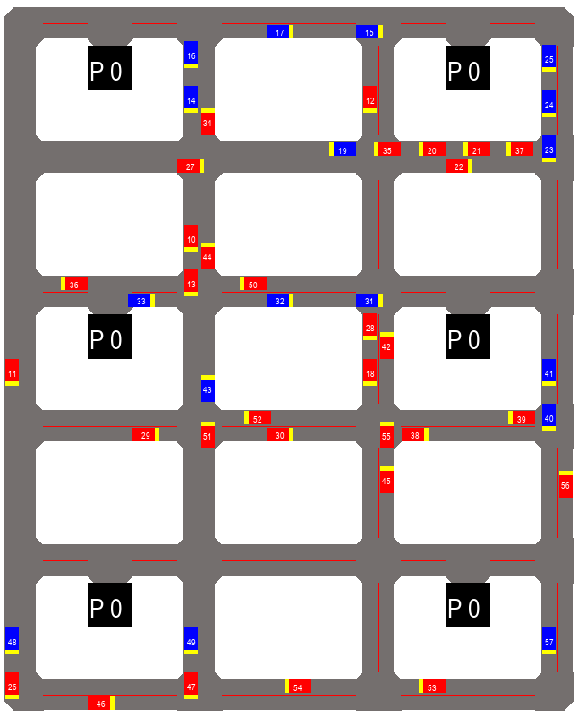

# Centralized Planning of Autonomous Traffic - simulation

**Master thesis**: http://hdl.handle.net/10467/87975

## Requirements
* Python >= 3.6
* numpy
* pygame

## Start
```python
python run.py
```

Press arrow UP or RIGHT for start.

The configuration can be set in a file [defined_maps.py](https://gitlab.fit.cvut.cz/pletiond/dp_simulation/blob/master/defined_maps.py). 

For smaller screens, reduce the variable **tile_len**.

## Example


